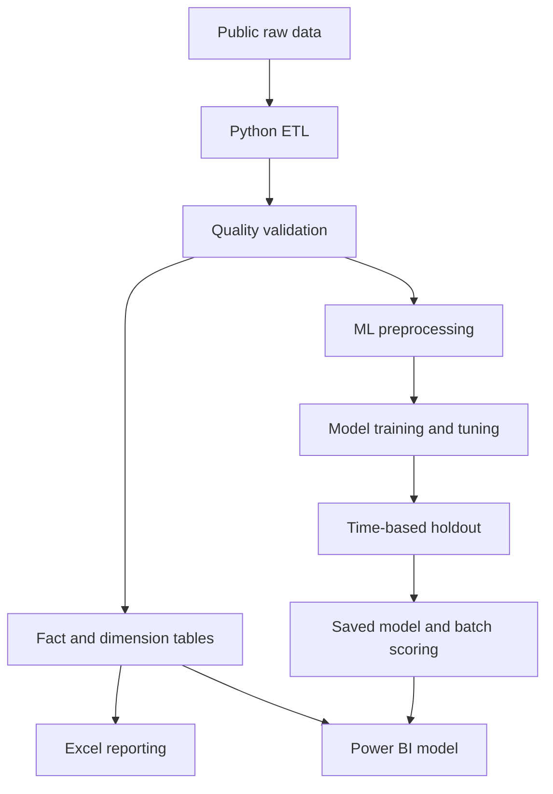
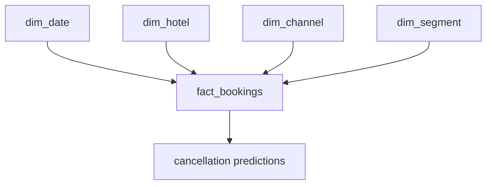

# Tourism Intelligence Dashboard

### Sales, Customer, Campaign & Cancellation Risk Analytics

[](https://powerbi.microsoft.com/)
[](https://www.python.org/)
[](#data-model)
[](https://www.microsoft.com/microsoft-365/excel)
[](#project-status)

> An end-to-end tourism analytics portfolio project that converts raw booking and market data into a validated analytical model, an interactive Power BI report, a management Excel workbook, and a machine-learning workflow for booking cancellation risk.

---

## Table of Contents

- [Project Overview](#project-overview)
- [Business Problem](#business-problem)
- [Project Objectives](#project-objectives)
- [Data Sources and Data Honesty](#data-sources-and-data-honesty)
- [End-to-End Architecture](#end-to-end-architecture)
- [1. Data Acquisition](#1-data-acquisition)
- [2. Data Cleaning and Validation](#2-data-cleaning-and-validation)
- [3. Feature Engineering](#3-feature-engineering)
- [4. Data Model](#4-data-model)
- [5. Business KPIs](#5-business-kpis)
- [6. Machine Learning](#6-machine-learning)
- [7. Batch Scoring](#7-batch-scoring)
- [8. Excel Reporting](#8-excel-reporting)
- [9. Power BI Dashboard](#9-power-bi-dashboard)
- [Key Results](#key-results)
- [Business Recommendations](#business-recommendations)
- [Data Quality, Privacy, and Limitations](#data-quality-privacy-and-limitations)
- [Future Improvements](#future-improvements)
- [References](#references)

---

## Project Overview

The **Tourism Intelligence Dashboard** is a complete data analytics and machine-learning solution designed for tourism, hotel, and travel operations.

The project combines four analytical areas:

1. **Booking and revenue intelligence** — monitors booking volume, realised revenue, ADR, length of stay, and revenue lost to cancellations.
2. **Customer and channel analysis** — compares customer types, countries, reserved room types, market segments, and distribution channels.
3. **Campaign funnel analytics** — demonstrates how marketing activity can be measured from message delivery through attributed bookings and ROAS.
4. **Cancellation risk analytics** — assigns a cancellation probability to each eligible booking so high-risk, high-value cases can be prioritised for follow-up.

The final deliverables include:

- A reproducible Python ETL and machine-learning pipeline.
- A data-quality audit.
- A Power BI-ready star schema.
- SQL schema and analytical support files.
- A trained cancellation-risk model.
- A batch-scoring script for new bookings.
- A 10-worksheet Excel management workbook.
- A four-page interactive Power BI dashboard.
- Technical and business documentation for GitHub and interviews.

## Business Problem

Tourism businesses often manage bookings, customers, marketing activity, and operational reports across disconnected systems. This creates several problems:

- KPI definitions become inconsistent across teams.
- Cancellation patterns and exposed revenue are difficult to identify early.
- Customer, market segment, and distribution channel performance cannot be compared efficiently.
- Campaign reporting stops at opens or clicks instead of measuring bookings and revenue.
- Management receives historical reports but lacks a forward-looking risk view.
- Manual spreadsheet work increases refresh time and the chance of errors.

This project addresses those problems by creating a single analytical workflow from source data to business action.

## Project Objectives

1. Acquire and document suitable real-world public datasets.
2. Preserve the raw data as the source of truth.
3. Clean, validate, and transform booking and market data reproducibly.
4. Create unique analytical booking identifiers without removing legitimate transactions.
5. Build a scalable fact-and-dimension data model.
6. Define reusable revenue, booking, cancellation, customer, and campaign KPIs.
7. Train and compare multiple cancellation-classification models.
8. Evaluate the selected model on a later time-based holdout.
9. Score bookings with cancellation probability and operational risk bands.
10. Present the results in Excel and Power BI for management use.

---

## Data Sources and Data Honesty

This portfolio uses a combination of **real-world public data**, **official public data**, **synthetic campaign data**, and **processed analytical outputs**.

| Dataset | Type | Rows used | Purpose |
|---|---:|---:|---|
| Hotel Booking Demand | Real-world, anonymised public data | 119,390 bookings | Main booking, revenue, customer, and cancellation analysis |
| Malaysia Monthly Arrivals by State of Entry | Official Malaysian government open data | 92,674 records in the project snapshot | Tourism market context |
| Campaign/API funnel | Synthetic, generated with random seed `42` | Project-generated | Demonstrates campaign funnel, CAC, and ROAS analytics |
| Processed fact and dimension tables | Derived data | Generated by the pipeline | SQL, Excel, Power BI, and machine-learning consumption |

### Hotel Booking Demand

The main dataset contains **119,390 anonymised bookings** from one resort hotel and one city hotel in Portugal. The arrival dates cover **July 2015 to August 2017**.

It is a real-world research dataset, but it is:

- Not Andalusia company data.
- Not Malaysian hotel data.
- Anonymised and intended for research or educational use.

Main source links:

- [Hotel Booking Demand research article](https://doi.org/10.1016/j.dib.2018.11.126)
- [PubMed record](https://pubmed.ncbi.nlm.nih.gov/30581903/)
- [Kaggle dataset page](https://www.kaggle.com/datasets/jessemostipak/hotel-booking-demand)
- [CSV mirror used for reproducible download](https://raw.githubusercontent.com/aaqibqadeer/Hotel-booking-demand/master/hotel_bookings.csv)

### Malaysia Monthly Arrivals

The market-context dataset is published by the Malaysian Government through data.gov.my and contains monthly arrival records by:

- Nationality.
- State of entry.
- Sex.
- Month.

Source links:

- [Malaysia arrivals data catalogue](https://data.gov.my/data-catalogue/arrivals_soe)
- [Direct CSV source](https://storage.data.gov.my/demography/arrivals_soe.csv)

The `state of entry` represents where a visitor entered Malaysia; it does not necessarily represent the visitor's final destination.

This dataset is kept as a separate market-context fact table. It is **not used to train the cancellation model** because its geography, period, and level of aggregation differ from the hotel booking data.

### Synthetic Campaign Data

Internal CRM, WhatsApp, email, SMS, and API-blasting records were not publicly available. Therefore, the campaign funnel was generated synthetically with a fixed random seed for reproducibility.

It demonstrates this funnel:

```text
Sent → Delivered → Opened → Clicks → Leads → Bookings
```

The synthetic table includes:

- Campaign month and channel.
- Messages sent and delivered.
- Opens and clicks.
- Leads and attributed bookings.
- Campaign spend.
- Attributed revenue.

Every campaign visual must retain the notice:

> **SYNTHETIC PORTFOLIO DATA — REPLACE WITH CRM EXPORT**

Synthetic results demonstrate analytical design only and must not be presented as actual company performance.

---

## End-to-End Architecture



The workflow follows these stages:

1. **Extract** raw booking and market data.
2. **Transform** missing values, dates, categories, and analytical fields.
3. **Validate** row counts, identifiers, numeric ranges, and known data-quality issues.
4. **Model** the data as facts, dimensions, measures, and prediction outputs.
5. **Train** and compare cancellation-classification models.
6. **Score** eligible bookings with probabilities and risk bands.
7. **Report** historical performance and forward-looking risk through Excel and Power BI.

---

## 1. Data Acquisition

The raw source files are downloaded and stored without overwriting their original values.

```text
data/raw/hotel_bookings.csv
data/raw/arrivals_soe.csv
```

Keeping raw data separate from processed data provides:

- Reproducibility.
- Auditability.
- A stable source of truth.
- The ability to rerun the entire pipeline after code changes.

The booking source does not contain a reliable unique booking identifier. The ETL pipeline therefore creates a deterministic analytical `booking_id` instead of assuming that identical-looking rows are duplicates.

## 2. Data Cleaning and Validation

The main pipeline is:

```text
src/run_pipeline.py
```

It performs extraction, cleaning, feature engineering, validation, model preparation, and output generation.

### Core Cleaning Rules

- Fill missing `children` values with `0`.
- Replace missing country codes with `UNK`.
- Construct a valid arrival date from arrival year, month, and day.
- Standardise text and categorical fields.
- Clip negative ADR values to `0` for analytical revenue calculations.
- Flag bookings with zero total guests.
- Validate cancellation flags and numeric ranges.
- Preserve all 119,390 source records.

### Duplicate Handling

Duplicate-looking rows are audited but are not removed automatically.

The source does not include an original booking ID, so two identical rows may still represent two separate bookings. A blind `drop_duplicates()` operation could therefore understate:

- Total bookings.
- Revenue.
- Cancellation volume.
- Customer and channel contribution.

The pipeline creates a new `booking_id`, records duplicate-like patterns in the quality report, and excludes only records that fail defined model-eligibility rules.

### Data-Quality Output

```text
data/quality/data_quality_report.csv
```

The report tracks issues such as:

- Missing country.
- Missing number of children.
- Negative ADR.
- Zero-guest bookings.
- Invalid dates.
- Duplicate-looking records.
- Records excluded from machine-learning training.

Final checks confirm:

- 119,390 booking records are retained.
- Every generated booking ID is unique.
- Prediction probabilities remain between `0` and `1`.
- Excel formulas contain no calculation errors.
- Core KPI totals reconcile across generated outputs.

## 3. Feature Engineering

The pipeline creates business-ready fields from the raw booking variables.

### Stay and Guest Features

```python
total_nights = stays_in_weekend_nights + stays_in_week_nights
total_guests = adults + children + babies
```

### Analytical Revenue Features

```python
gross_booking_value = adr_clean * total_nights
realized_revenue = gross_booking_value if is_canceled == 0 else 0
revenue_lost_to_cancellation = gross_booking_value if is_canceled == 1 else 0
```

These are analytical estimates for portfolio reporting. They are not audited accounting revenue because the public dataset does not contain payments, refunds, taxes, discounts, commissions, or final invoices.

### Date and Business Features

Additional fields include:

- Arrival date.
- Date key.
- Arrival year and month.
- Length-of-stay grouping.
- Guest count.
- Booking status grouping.
- Revenue outcome.
- Model eligibility.
- Cancellation probability.
- Prediction class.
- Risk band.

## 4. Data Model

The Power BI model contains **10 logical tables**:

| Table | Type | Purpose |
|---|---|---|
| `fact_bookings` | Fact | Booking, guest, stay, cancellation, ADR, and revenue-level records |
| `fact_market_arrivals` | Fact | Malaysian monthly arrivals for external market context |
| `fact_campaign_funnel_synthetic` | Fact | Synthetic campaign delivery, engagement, spend, bookings, and revenue |
| `cancellation_predictions_holdout` | Prediction output | Booking-level holdout probabilities, prediction classes, and risk bands |
| `data_quality_report` | Audit | Quality rules, issue counts, and validation results |
| `dim_date` | Dimension | Date, month, quarter, year, week, and calendar fields |
| `dim_hotel` | Dimension | Hotel category |
| `dim_channel` | Dimension | Booking distribution channel |
| `dim_segment` | Dimension | Booking market segment |
| `_Measures` | Measure table | Central location for reusable DAX measures |

The core booking model follows a star schema:



Key modelling principles:

- Dimension-to-fact relationships use one-to-many filtering.
- Surrogate keys are used for reusable dimensions.
- Measures are stored in `_Measures`.
- Prediction results are connected at booking level.
- Market arrivals, campaign data, and quality audits remain separate analytical subjects unless a valid shared dimension exists.
- Fact-to-fact many-to-many relationships are avoided.

## 5. Business KPIs

### Booking and Revenue Measures

| KPI | Definition |
|---|---|
| Total Bookings | Count of booking records |
| Cancelled Bookings | Bookings where `is_canceled = 1` |
| Stayed Bookings | Bookings where `is_canceled = 0` |
| Cancellation Rate | Cancelled bookings divided by total bookings |
| Gross Booking Value | ADR multiplied by total nights |
| Realised Revenue | Gross booking value from non-cancelled bookings |
| Revenue Lost to Cancellation | Gross booking value associated with cancelled bookings |
| Average ADR | Average cleaned daily rate |
| Average Lead Time | Average days between booking and arrival |
| Average Stay | Average total nights per booking |

### Campaign Measures

| KPI | Definition |
|---|---|
| Delivery Rate | Delivered messages divided by messages sent |
| Open Rate | Opened messages divided by delivered messages |
| Click-Through Rate | Clicks divided by delivered messages |
| Campaign Conversion Rate | Attributed bookings divided by delivered messages |
| Cost per Lead | Campaign spend divided by leads |
| Customer Acquisition Cost | Campaign spend divided by attributed bookings |
| Campaign ROAS | Attributed revenue divided by campaign spend |

Example DAX:

```DAX
Total Bookings =
COUNTROWS('fact_bookings')
```

```DAX
Cancellation Rate =
DIVIDE([Cancelled Bookings], [Total Bookings])
```

```DAX
Campaign ROAS =
DIVIDE([Attributed Revenue (MYR)], [Campaign Spend (MYR)])
```

Rates are formatted as percentages, campaign ROAS as `0.0x`, booking values as EUR, and campaign values as MYR.

---

## 6. Machine Learning

### Problem Definition

The machine-learning task predicts:

> Based only on information available at or near booking time, how likely is this booking to be cancelled?

Target:

```text
is_canceled

0 = booking not cancelled
1 = booking cancelled
```

This is a supervised binary-classification problem.

### Input Features

The model uses booking-time variables such as:

- Hotel.
- Lead time.
- Arrival month.
- Total nights.
- Total guests.
- Country.
- Market segment.
- Distribution channel.
- Previous cancellations.
- Deposit type.
- Customer type.
- ADR.
- Special requests.
- Required parking spaces.

### Leakage Prevention

Fields that reveal or are strongly influenced by the final outcome are excluded from training, including:

- `reservation_status`.
- `reservation_status_date`.
- `assigned_room_type`.
- `booking_changes`.
- `days_in_waiting_list`.

For example, using `reservation_status = Canceled` would directly expose the target and produce misleadingly high model performance.

### Preprocessing

The preprocessing workflow includes:

- Median imputation for missing numeric values.
- Categorical imputation where required.
- One-hot encoding for Logistic Regression.
- Encoded categorical inputs for tree-based models.
- Consistent preprocessing packaged with the trained estimator.

### Time-Based Split

The data is ordered chronologically instead of being split randomly:

```text
Earlier bookings → Training
Following period → Validation
Latest bookings  → Holdout test
```

The final holdout contains the latest booking period, approximately **22 May to 31 August 2017**.

This provides a more realistic test: the model learns from historical bookings and is evaluated on later, unseen booking behaviour.

The validation data is used to:

- Compare model families.
- Tune hyperparameters.
- Select the classification threshold.

The holdout data is used once for final evaluation. Its threshold is not retuned on the test set.

### Models Compared

| Model | Role |
|---|---|
| Logistic Regression | Interpretable linear baseline |
| Random Forest | Non-linear bagging ensemble |
| Histogram Gradient Boosting | Sequential boosting model for complex interactions |

### Hyperparameter-Tuning Results

Validation results:

| Model Variant | ROC-AUC | PR-AUC | Accuracy | Precision | Recall | F1 | Brier | Threshold |
|---|---:|---:|---:|---:|---:|---:|---:|---:|
| **HGB — leaves=15, LR=0.10** | **0.8971** | **0.8624** | **81.33%** | **75.02%** | 78.65% | 76.79% | **0.1308** | 0.290 |
| HGB — leaves=31, LR=0.08 | 0.8963 | 0.8621 | 80.94% | 73.46% | 80.55% | **76.84%** | 0.1315 | 0.273 |
| HGB — leaves=63, LR=0.05 | 0.8943 | 0.8610 | 80.33% | 72.32% | **80.85%** | 76.34% | 0.1319 | 0.279 |
| Random Forest — depth=12, leaf=5 | 0.8882 | 0.8516 | 80.03% | 73.04% | 77.90% | 75.39% | 0.1322 | 0.392 |
| Random Forest — depth=18, leaf=3 | 0.8855 | 0.8483 | 79.98% | 72.69% | 78.54% | 75.50% | 0.1333 | 0.364 |
| Logistic Regression — C=0.2 | 0.8756 | 0.8410 | 79.14% | 72.21% | 76.20% | 74.15% | 0.1380 | 0.440 |
| Logistic Regression — C=1.0 | 0.8752 | 0.8405 | 78.72% | 71.11% | 77.17% | 74.01% | 0.1384 | 0.431 |

The 15-leaf Histogram Gradient Boosting model was selected because it produced the best overall combination of:

- ROC-AUC.
- PR-AUC.
- Accuracy.
- Precision.
- Probability calibration.
- Competitive recall and F1.
- Lower complexity than the larger HGB variants.

### Holdout Test Results

Only the selected configuration from each model family was evaluated on the unseen holdout.

| Model | ROC-AUC | PR-AUC | Accuracy | Precision | Recall | F1 | Brier | Threshold |
|---|---:|---:|---:|---:|---:|---:|---:|---:|
| **Histogram Gradient Boosting** | **0.8473** | **0.7908** | **75.89%** | **68.95%** | 70.76% | 69.84% | 0.1614 | 0.290 |
| Random Forest | 0.8390 | 0.7802 | 74.50% | 66.02% | 72.87% | 69.28% | **0.1585** | 0.392 |
| Logistic Regression | 0.8378 | 0.7904 | 71.52% | 59.86% | **84.42%** | **70.05%** | 0.1706 | 0.440 |

### Final Model

```text
Model                   Histogram Gradient Boosting
Learning rate           0.10
Maximum leaf nodes      15
L2 regularisation       1.0
Classification threshold 0.290
Holdout ROC-AUC         0.8473
Holdout PR-AUC          0.7908
Holdout precision       68.95%
Holdout recall          70.76%
Holdout F1-score        69.84%
```

Interpretation:

- The model detected approximately **70.76% of actual cancellations**.
- Approximately **68.95% of bookings flagged by the selected threshold were genuine cancellations**.
- ROC-AUC of **0.8473** indicates useful ranking ability on later unseen data.
- The decline from validation to holdout reflects a realistic generalisation gap and reinforces the need for monitoring.

Logistic Regression achieved higher recall, but its lower precision would generate considerably more false alerts. The selected HGB model provides a more practical balance for operational follow-up.

### Classification Threshold and Risk Bands

The operational decision threshold is:

```text
Probability < 0.290  → predicted not cancelled
Probability ≥ 0.290 → predicted cancellation
```

The dashboard can additionally group probabilities into business-friendly bands:

```text
Low risk     0% to <30%
Medium risk  30% to <60%
High risk    60% to 100%
```

The model threshold and the dashboard risk bands serve different purposes:

- The **threshold** converts probability into a binary prediction.
- The **risk band** supports prioritisation and reporting.

The model should support human follow-up. It should not automatically cancel a booking, reject a customer, or impose a penalty.

## 7. Batch Scoring

The trained preprocessing and model pipeline is saved as:

```text
models/cancellation_risk_model.joblib
```

New booking files can be scored without retraining:

```bash
python src/score_new_bookings.py \
  --input new_bookings.csv \
  --output scored_bookings.csv
```

Expected output fields include:

```text
booking_id
cancellation_probability
predicted_is_canceled
risk_band
model_name
decision_threshold
```

Batch scoring was tested across all 119,390 project bookings, with probability values validated between `0` and `1`.

In a production setting, this process could run daily and send high-value, high-risk bookings to a CRM follow-up queue.

## 8. Excel Reporting

The management workbook is:

```text
excel/Tourism_Intelligence_Analysis.xlsx
```

It contains 10 worksheets covering:

- Executive KPIs.
- Booking and revenue trends.
- Customer analysis.
- Channel and segment analysis.
- Campaign funnel performance.
- Cancellation-risk results.
- Model comparison.
- Data-quality checks.
- Supporting analytical tables.

The workbook provides:

- Formula-driven KPIs.
- Filterable tables.
- Management charts.
- Transparent calculations.
- A lightweight reporting option for users without Power BI.

The final workbook was checked for formula errors, data consistency, and visual readability.

---

## 9. Power BI Dashboard

The current report file is:

```text
dashboard/Andalusia_Tourism.pbix
```

Report title:

> **Tourism Intelligence Dashboard**

Subtitle:

> **Sales, Customer, Campaign & Cancellation Risk Analytics**

The current PBIX contains **four report pages** and **10 model tables**.

### Page 1 — Executive Overview

Purpose: provide management with an immediate view of booking, revenue, and cancellation performance.

| Visual | Fields or measures |
|---|---|
| Multi-row KPI card | Total Bookings, Cancellation Rate, Realised Revenue, Revenue Lost, Average ADR, Stayed Bookings |
| Line chart | Total Bookings by arrival year and month |
| Line chart | Realised Revenue by arrival year and month |
| Clustered bar chart | Cancellation Rate by Distribution Channel |
| Clustered bar chart | Realised Revenue by Market Segment |
| Slicers | Campaign Month, Hotel, Distribution Channel, Market Segment |

Management questions answered:

- How many bookings were received?
- How much analytical revenue was realised?
- How much booking value was exposed through cancellations?
- Which channels have higher cancellation rates?
- Which market segments contribute the most realised revenue?

### Page 2 — Customer & Booking Analysis

Purpose: explain customer behaviour and compare the commercial value of booking groups.

| Visual | Fields or measures |
|---|---|
| Matrix | Customer Type with Total Bookings, Average Lead Time, Average Stay, Cancellation Rate, and Realised Revenue |
| Clustered bar chart | Total Bookings by Country |
| Clustered column chart | Realised ADR by Reserved Room Type |
| Scatter chart | Average Lead Time, Total Bookings, and Cancellation Rate by Market Segment |
| Slicers | Campaign Month, Hotel, Distribution Channel, Market Segment |

Management questions answered:

- Which customer types generate the most bookings and revenue?
- Which source countries contribute the most booking volume?
- How does ADR vary by reserved room type?
- Which segments combine long lead times, high booking volume, and high cancellation rates?

### Page 3 — Cancellation Risk Monitor

Purpose: convert model output into an operational retention queue.

| Visual | Fields or measures |
|---|---|
| Multi-row KPI card | Scored Bookings, High-Risk Bookings, High-Risk Share, Average Cancellation Probability, High-Risk Booking Value |
| Column chart | Booking count by Risk Band |
| Detail table | Booking ID, Arrival Year, Country, Gross Booking Value, and Segment |
| Slicers | Campaign Month, Hotel, Distribution Channel, Market Segment |
| Evaluation note | Model evaluated on a later time-based holdout |

Management questions answered:

- How many bookings have been scored?
- What share is classified as high risk?
- How much booking value is exposed in the high-risk group?
- Which bookings should receive confirmation or retention follow-up first?

The page is designed for prioritisation, not automatic enforcement.

### Page 4 — Campaign Funnel & ROAS

Purpose: show marketing efficiency from message delivery to attributed revenue.

| Visual | Fields or measures |
|---|---|
| Data notice banner | Synthetic portfolio data — replace with CRM export |
| Funnel | Sent → Delivered → Opened → Clicks → Leads → Bookings |
| Multi-row KPI card | Delivery Rate, Open Rate, Click-Through Rate, Campaign Conversion Rate, Cost per Lead, Customer Acquisition Cost, Campaign ROAS |
| Clustered bar chart | Campaign ROAS by Channel |
| Line chart | Attributed Revenue and Campaign Spend by Campaign Month |
| Slicers | Campaign Month and Channel |

Management questions answered:

- Where does the campaign funnel lose the most users?
- Which channel generates the strongest simulated ROAS?
- Is attributed revenue growing faster than campaign spend?
- Which metrics should be replaced when real CRM data becomes available?

### Power BI Interaction and Formatting

- Shared slicers support page-level filtering.
- DAX measures recalculate automatically under filter context.
- Visual headers and excess gridlines are minimised for a clean management layout.
- Booking and revenue trends use a year-month date hierarchy.
- Rates use percentage formatting.
- Hotel booking values use EUR.
- Synthetic campaign spend and revenue use MYR.
- ROAS uses `0.0x` formatting.
- The campaign page includes a prominent synthetic-data disclosure.
- The risk page includes a time-based-holdout disclosure.
  
---

## Key Results

### Data and Reporting

- **119,390** booking records retained.
- **92,674** Malaysian arrival records included in the project snapshot.
- **119,390** unique analytical booking IDs.
- Approximately **37%** of source bookings were cancelled.
- Approximately **€16.73 million** in analytical realised revenue is reported in the current project output.
- Four interactive Power BI pages completed.
- Ten Power BI model tables included.
- Ten Excel worksheets completed.
- Synthetic campaign data clearly separated from real-world data.

### Machine Learning

- Best model: **Histogram Gradient Boosting**.
- Holdout ROC-AUC: **0.8473**.
- Holdout PR-AUC: **0.7908**.
- Holdout precision: **68.95%**.
- Holdout recall: **70.76%**.
- Holdout F1-score: **69.84%**.
- Selected threshold: **0.290**.

These results show that the model provides useful prioritisation on unseen later bookings, but it is not perfect and requires operational monitoring.

## Business Recommendations

1. **Prioritise high-value, high-risk bookings** for confirmation calls, reminders, or flexible rescheduling support.
2. **Review channel-specific cancellation policies** where cancellation rate and exposed booking value remain persistently high.
3. **Create targeted retention journeys** based on lead time, customer type, deposit type, and previous cancellation behaviour.
4. **Monitor false-positive cost** before offering discounts or incentives to every high-risk booking.
5. **Replace synthetic campaign records with CRM exports** and measure each channel from delivery through attributed revenue.
6. **Redirect campaign budget using conversion and ROAS**, not opens and clicks alone.
7. **Schedule data-quality checks and report refreshes** so management decisions use current, validated data.
8. **Retrain and recalibrate the model periodically** when new booking behaviour becomes available.

---

## Data Quality, Privacy, and Limitations

- This is an educational portfolio project, not a production system.
- The hotel data represents anonymised Portuguese hotel bookings, not Andalusia or Malaysian company transactions.
- Malaysian arrival data provides external context and is not joined directly into the booking cancellation model.
- Campaign records are synthetic and do not represent real marketing performance.
- Analytical revenue is estimated from cleaned ADR and total nights; it is not accounting revenue.
- Duplicate-looking source rows are retained because the original dataset lacks a reliable booking ID.
- The holdout period contains later booking behaviour, so performance is lower and more realistic than validation performance.
- Model probabilities may drift when customer behaviour, channels, pricing, or cancellation policies change.
- Predictions should support human decisions and should not be used to automatically penalise customers.
- No personally identifiable customer information should be added to a public repository.
- Public-data licences and attribution requirements must be reviewed before redistributing source data.

## Future Improvements

- Replace synthetic campaign data with authorised CRM or campaign-platform exports.
- Add API ingestion, scheduled ETL, and incremental Power BI refresh.
- Deploy batch scoring as a secure REST API or scheduled job.
- Add model calibration plots and financial threshold optimisation.
- Monitor data drift, probability drift, precision, recall, and business intervention outcomes.
- Add explainability with SHAP or permutation importance.
- Build revenue and demand forecasting.
- Add customer lifetime value and repeat-customer segmentation.
- Add row-level security for management, sales, and marketing teams.
- Use a cloud warehouse and orchestration service for production-scale refreshes.

---

## Technology Stack

| Technology | Use |
|---|---|
| Python | Data acquisition, ETL, validation, feature engineering, model training, and scoring |
| Pandas and NumPy | Data transformation and analytical calculations |
| scikit-learn | Preprocessing, model training, tuning, and evaluation |
| SQL | Relational schema design and reusable analytical structure |
| Power BI | Data modelling, DAX, filtering, visual analytics, and management reporting |
| Power Query | Source loading, transformation, and refresh |
| Excel | Formula validation, supporting analysis, and management reporting |
| Joblib | Saved preprocessing and machine-learning pipeline |
| Git and GitHub | Version control, documentation, and portfolio delivery |

## References

- Antonio, N., de Almeida, A., and Nunes, L. (2019). [Hotel booking demand datasets](https://doi.org/10.1016/j.dib.2018.11.126), *Data in Brief*, 22, 41–49.
- [Hotel Booking Demand dataset on Kaggle](https://www.kaggle.com/datasets/jessemostipak/hotel-booking-demand)
- [Malaysia Monthly Arrivals by State of Entry — data.gov.my](https://data.gov.my/data-catalogue/arrivals_soe)
- [Power BI documentation](https://learn.microsoft.com/power-bi/)
- [scikit-learn documentation](https://scikit-learn.org/stable/)

## Licence

The original code and documentation in this repository may be shared for educational and portfolio purposes. Third-party datasets remain subject to their original licences and attribution requirements. Review those terms before redistributing raw source files.
