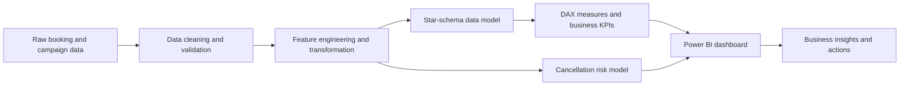

# Tourism Intelligence Dashboard

### Sales, Customer, Campaign & Cancellation Risk Analytics

[](https://powerbi.microsoft.com/)
[](https://www.python.org/)
[](#)
[](https://www.microsoft.com/microsoft-365/excel)
[](#)

> **Portfolio project:** An end-to-end tourism analytics solution that transforms booking, customer, operational, and campaign data into actionable business intelligence.

---

## Project Overview

The *Tourism Intelligence Dashboard* is a Power BI business intelligence solution designed to support data-driven decision-making in the tourism and travel industry.

The project consolidates multiple analytical areas into a single reporting environment:

- Sales and revenue performance
- Booking and cancellation trends
- Customer behaviour and segmentation
- Distribution channel performance
- Campaign and API funnel effectiveness
- Forward-looking cancellation risk analysis

The dashboard is designed for management, marketing, sales, and business development teams that need a clear view of business performance, risks, and growth opportunities.

## Business Problem

Tourism businesses often manage booking, customer, sales, and campaign data across disconnected files and systems. This makes it difficult to:

- Monitor key performance indicators consistently
- Identify the causes of cancellations and revenue loss
- Compare customer segments and distribution channels
- Measure campaign efficiency from delivery to booking
- Prioritise high-risk bookings for early intervention
- Convert raw operational data into clear management actions

This project addresses these challenges through a structured data model, reusable DAX measures, interactive visualisations, and a machine-learning risk layer.

## Project Objectives

1. Build a central tourism analytics data hub.
2. Clean, validate, and transform raw booking and campaign data.
3. Create a scalable star-schema data model.
4. Develop business KPIs using DAX.
5. Analyse sales, customers, channels, and cancellations.
6. Evaluate campaign performance across the full conversion funnel.
7. Estimate booking cancellation risk using machine learning.
8. Present insights through a professional, interactive Power BI dashboard.

## Dashboard Pages

### 1. Executive Overview

Provides management with a high-level view of overall performance.

**Key indicators:**

- Total Bookings
- Realised Revenue
- Average Daily Rate (ADR)
- Cancellation Rate
- Average Lead Time
- Average Length of Stay
- Revenue and booking trends

### 2. Sales and Booking Performance

Analyses how revenue and bookings change over time and across key business dimensions.

**Key analysis:**

- Monthly booking and revenue trends
- Hotel or product performance
- Market segment comparison
- Distribution channel performance
- Country or source-market contribution
- Confirmed versus cancelled bookings

### 3. Customer and Cancellation Analysis

Explores customer behaviour and the operational factors associated with cancellations.

**Key analysis:**

- Customer type comparison
- Lead-time distribution
- Length-of-stay behaviour
- Cancellation rate by segment and channel
- Revenue contribution by customer group
- High-risk booking characteristics

### 4. Campaign and API Funnel

Tracks campaign performance from initial delivery to completed booking.

**Funnel stages:**

```text
Sent → Delivered → Opened → Clicked → Leads → Bookings
```

**Key campaign KPIs:**

- Delivery Rate
- Open Rate
- Click-Through Rate (CTR)
- Campaign Conversion Rate
- Cost per Lead (CPL)
- Customer Acquisition Cost (CAC)
- Campaign Return on Ad Spend (ROAS)
- Attributed Revenue

> **Data notice:** Campaign and API funnel records in this portfolio version are synthetic and are intended to demonstrate the analytical design. They should be replaced with an authorised CRM or campaign-platform export before real business use.

### 5. Cancellation Risk Analytics

Presents the output of a machine-learning model that estimates the likelihood of a booking being cancelled.

**Key analysis:**

- Risk probability by booking
- Low-, medium-, and high-risk groups
- Risk distribution by segment and channel
- Important predictive factors
- Potential revenue exposed to cancellation risk
- Suggested intervention priorities

> To reduce data leakage and better represent future performance, the model should be evaluated using a later time-based holdout rather than a random split.

## Data Workflow



## Data Model

The Power BI model follows a **star-schema design** to improve usability, performance, and measure consistency.

| Table | Type | Purpose |
|---|---|---|
| `fact_bookings` | Fact | Booking, guest, stay, cancellation, and revenue-level records |
| `fact_campaigns` | Fact | Campaign spend, delivery, engagement, leads, and attributed bookings |
| `dim_date` | Dimension | Date, month, quarter, year, week, and calendar attributes |
| `dim_hotel` | Dimension | Hotel or tourism product information |
| `dim_channel` | Dimension | Booking and distribution channels |
| `dim_segment` | Dimension | Customer or market segments |
| `_Measures` | Measures | Centralised DAX measures used throughout the report |

## Example KPI Definitions

| KPI | Definition |
|---|---|
| Total Bookings | Count of booking records |
| Realised Revenue | Revenue from non-cancelled or completed bookings |
| Cancellation Rate | Cancelled bookings divided by total bookings |
| Average Lead Time | Average number of days between booking and arrival |
| Average Stay | Average number of nights per booking |
| ADR | Realised room revenue divided by occupied room nights |
| Delivery Rate | Delivered messages divided by messages sent |
| Open Rate | Opened messages divided by delivered messages |
| CTR | Clicks divided by delivered messages |
| Campaign Conversion Rate | Attributed bookings divided by delivered messages |
| CPL | Campaign spend divided by leads generated |
| CAC | Campaign spend divided by attributed customers or bookings |
| Campaign ROAS | Attributed revenue divided by campaign spend |

## Machine Learning — Booking Cancellation Prediction

### Problem Definition

The machine-learning component predicts the probability that a customer will cancel a booking. The problem is formulated as a **supervised binary-classification task**:

* `0` — Booking not cancelled
* `1` — Booking cancelled

The predicted cancellation probability allows the business to identify high-risk bookings and take proactive action before potential revenue is lost.

### Input Features

The model uses booking, customer, behavioural, and pricing variables, including:

* Lead time
* Booking month
* Length of stay
* Number of guests
* Customer type
* Market segment
* Distribution channel
* Previous cancellations
* Deposit type
* Number of special requests
* Average daily rate (ADR)

These features help the model identify patterns associated with booking cancellation behaviour.

### Models Evaluated

Three classification algorithms were evaluated:

| Model                       | Role                                           |
| --------------------------- | ---------------------------------------------- |
| Logistic Regression         | Interpretable baseline model                   |
| Random Forest               | Non-linear bagging ensemble                    |
| Histogram Gradient Boosting | Boosting model for complex non-linear patterns |

The hyperparameters evaluated included:

* **Histogram Gradient Boosting:** learning rate, maximum leaf nodes, and L2 regularisation.
* **Random Forest:** number of trees, maximum depth, and minimum samples per leaf.
* **Logistic Regression:** regularisation strength (`C`) with balanced class weights.

### Evaluation Strategy

The model-development process used two evaluation stages:

1. **Validation set** — used to compare algorithms, tune hyperparameters, and select classification thresholds.
2. **Holdout test set** — used for the final evaluation on unseen data.

The threshold selected during validation was applied unchanged to the holdout test set. This prevents the test set from influencing model selection and provides a more realistic estimate of generalisation performance.

### Evaluation Metrics

The models were evaluated using:

| Metric           | Description                                                        | Preferred Direction |
| ---------------- | ------------------------------------------------------------------ | ------------------- |
| ROC-AUC          | Ability to distinguish cancelled and non-cancelled bookings        | Higher              |
| PR-AUC           | Precision-recall performance for the cancelled class               | Higher              |
| Accuracy         | Overall percentage of correctly classified bookings                | Higher              |
| Precision        | Percentage of high-risk predictions that were actual cancellations | Higher              |
| Recall           | Percentage of actual cancellations correctly identified            | Higher              |
| F1-score         | Balance between precision and recall                               | Higher              |
| Brier score      | Accuracy and calibration of predicted probabilities                | Lower               |
| Confusion matrix | Distribution of true and false predictions                         | Context-dependent   |

Recall is particularly important because missed high-risk bookings may lead to preventable revenue loss. However, precision must also be considered because low precision can result in unnecessary customer interventions.

---

### Hyperparameter-Tuning Results

The following results were obtained from the validation dataset:

| Model Variant                    |    ROC-AUC |     PR-AUC |   Accuracy |  Precision |     Recall |   F1-score |      Brier | Threshold |
| -------------------------------- | ---------: | ---------: | ---------: | ---------: | ---------: | ---------: | ---------: | --------: |
| **HGB — leaves=15, LR=0.10**     | **0.8971** | **0.8624** | **81.33%** | **75.02%** |     78.65% |     76.79% | **0.1308** |     0.290 |
| HGB — leaves=31, LR=0.08         |     0.8963 |     0.8621 |     80.94% |     73.46% |     80.55% | **76.84%** |     0.1315 |     0.273 |
| HGB — leaves=63, LR=0.05         |     0.8943 |     0.8610 |     80.33% |     72.32% | **80.85%** |     76.34% |     0.1319 |     0.279 |
| Random Forest — depth=12, leaf=5 |     0.8882 |     0.8516 |     80.03% |     73.04% |     77.90% |     75.39% |     0.1322 |     0.392 |
| Random Forest — depth=18, leaf=3 |     0.8855 |     0.8483 |     79.98% |     72.69% |     78.54% |     75.50% |     0.1333 |     0.364 |
| Logistic Regression — C=0.2      |     0.8756 |     0.8410 |     79.14% |     72.21% |     76.20% |     74.15% |     0.1380 |     0.440 |
| Logistic Regression — C=1.0      |     0.8752 |     0.8405 |     78.72% |     71.11% |     77.17% |     74.01% |     0.1384 |     0.431 |

### Tuning Interpretation

The Histogram Gradient Boosting variants achieved the strongest validation performance.

The configuration with 31 leaf nodes produced the highest validation F1-score of **76.84%**, while the 63-leaf configuration achieved the highest recall of **80.85%**. However, these more complex configurations had slightly lower accuracy, precision, ROC-AUC, and probability calibration.

The 15-leaf configuration was selected because it provided:

* The highest ROC-AUC
* The highest PR-AUC
* The highest accuracy
* The highest precision
* The lowest Brier score
* Competitive recall and F1-score
* Lower model complexity

---

### Holdout Test Results

Only the selected configuration from each model family was evaluated on the unseen holdout test set.

| Model                           |    ROC-AUC |     PR-AUC |   Accuracy |  Precision |     Recall |   F1-score |      Brier | Threshold |
| ------------------------------- | ---------: | ---------: | ---------: | ---------: | ---------: | ---------: | ---------: | --------: |
| **Histogram Gradient Boosting** | **0.8473** | **0.7908** | **75.89%** | **68.95%** |     70.76% |     69.84% |     0.1614 |     0.290 |
| Random Forest                   |     0.8390 |     0.7802 |     74.50% |     66.02% |     72.87% |     69.28% | **0.1585** |     0.392 |
| Logistic Regression             |     0.8378 |     0.7904 |     71.52% |     59.86% | **84.42%** | **70.05%** |     0.1706 |     0.440 |

### Holdout Interpretation

The Histogram Gradient Boosting model remained the strongest model for overall discrimination and balanced performance on unseen data.

It achieved:

* The highest ROC-AUC at **0.8473**
* The highest PR-AUC at **0.7908**
* The highest accuracy at **75.89%**
* The highest precision at **68.95%**
* A recall of **70.76%**
* An F1-score of **69.84%**

This means that the model identified approximately **70.76% of actual cancellations**. Among the bookings flagged as high-risk, approximately **68.95% were genuine cancellations**.

The Logistic Regression model achieved the highest recall of **84.42%** and a marginally higher F1-score of **70.05%**. However, its precision was only **59.86%**, meaning it generated substantially more false-positive alerts.

Random Forest achieved the lowest holdout Brier score of **0.1585**, indicating slightly better probability calibration. However, its discrimination, accuracy, precision, and F1-score were lower than the selected Histogram Gradient Boosting model.

---

### Validation vs Holdout Performance

The following table shows how the selected Histogram Gradient Boosting model performed across both datasets:

| Metric      | Validation | Holdout Test |   Change |
| ----------- | ---------: | -----------: | -------: |
| ROC-AUC     |     0.8971 |       0.8473 |  −0.0498 |
| PR-AUC      |     0.8624 |       0.7908 |  −0.0715 |
| Accuracy    |     81.33% |       75.89% | −5.44 pp |
| Precision   |     75.02% |       68.95% | −6.07 pp |
| Recall      |     78.65% |       70.76% | −7.89 pp |
| F1-score    |     76.79% |       69.84% | −6.95 pp |
| Brier score |     0.1308 |       0.1614 |  +0.0306 |

The reduction in holdout performance indicates a generalisation gap between the validation and unseen datasets. This is expected when the holdout data contains booking patterns that differ from the development data.

Despite this decline, the model maintained a ROC-AUC above **0.84**, indicating that it still provides useful predictive separation on unseen bookings.

---

### Final Model

The selected production candidate is:

```text
Model: Histogram Gradient Boosting
Learning rate: 0.10
Maximum leaf nodes: 15
L2 regularisation: 1.0
Classification threshold: 0.290
```

The final model was selected because it provided the best overall balance between:

* Cancellation-risk discrimination
* Prediction accuracy
* Precision and false-alert control
* Recall of cancelled bookings
* Probability calibration
* Model complexity

### Classification Threshold

The final classification threshold was set at **0.290**.

```text
Cancellation probability < 0.290  → Lower-risk booking
Cancellation probability ≥ 0.290 → High-risk booking
```

The threshold is lower than the default value of 0.50 because detecting potential cancellations is important for preventing revenue loss.

However, reducing the threshold further would increase recall while potentially lowering precision and generating more false alerts. Therefore, the final threshold should reflect the relative cost of:

* Contacting customers who would not have cancelled
* Missing genuine high-risk bookings
* Offering unnecessary discounts or incentives
* Losing revenue through preventable cancellations

### Business Application

High-risk predictions can support proactive retention strategies such as:

* Sending booking confirmation reminders
* Sending payment or deposit reminders
* Conducting confirmation calls
* Offering flexible date changes
* Requesting earlier final payments
* Providing targeted retention offers
* Prioritising high-value bookings for manual follow-up

### Model Monitoring

Before full production deployment, the model should be monitored for:

* Changes in cancellation behaviour
* Declining precision or recall
* Probability-calibration drift
* Changes in customer or market segments
* Differences between training and future booking data
* The financial impact of false positives and false negatives

The model should be retrained periodically when new booking and cancellation data becomes available.


## Technology Stack

| Technology | Usage |
|---|---|
| Power BI | Data modelling, DAX, interactive dashboard, and business reporting |
| Power Query | Data extraction, transformation, validation, and loading |
| Python | Data cleaning, exploratory analysis, feature engineering, and machine learning |
| SQL | Relational schema design and analytical queries |
| Excel | Data inspection, business validation, and supporting analysis |
| Git/GitHub | Version control, documentation, and portfolio presentation |

## Repository Structure

```text
andalusia-tourism-intelligence/
│
├── README.md
├── dashboard/
│   └── Andalusia_Tourism_Intelligence_Dashboard.pbix
├── data/
│   ├── raw/
│   ├── processed/
│   └── README.md
├── notebooks/
│   ├── 01_data_cleaning.ipynb
│   ├── 02_exploratory_analysis.ipynb
│   └── 03_cancellation_model.ipynb
├── sql/
│   ├── schema.sql
│   └── analytics_queries.sql
├── dax/
│   └── measures.dax
├── reports/
│   └── project_report.pdf
├── images/
│   ├── executive_overview.png
│   ├── customer_analysis.png
│   ├── campaign_funnel.png
│   └── cancellation_risk.png
└── requirements.txt
```

> The structure above is the recommended final repository layout. Remove any file or folder that is not included in your published project.

## How to Use This Project

### Power BI dashboard

1. Download or clone this repository.
2. Open `dashboard/Andalusia_Tourism_Intelligence_Dashboard.pbix` using Power BI Desktop.
3. Update the data-source paths in **Transform Data → Data source settings**.
4. Refresh the model.
5. Review relationships, calculated columns, and measures before publishing.

### Python analysis

```bash
git clone https://github.com/YOUR-USERNAME/andalusia-tourism-intelligence.git
cd andalusia-tourism-intelligence
python -m venv .venv
```

Activate the virtual environment, then install the dependencies:

```bash
pip install -r requirements.txt
```

Run the notebooks in numerical order:

```text
01_data_cleaning.ipynb
02_exploratory_analysis.ipynb
03_cancellation_model.ipynb
```

## Dashboard Preview

Add exported dashboard screenshots to the `images/` folder, then enable the links below.

<!--


-->

## Key Business Insights

Replace the statements below with results verified from the final dashboard:

- **Revenue:** `[Insert the strongest verified revenue trend.]`
- **Cancellations:** `[Insert the segment, channel, or period with the highest cancellation risk.]`
- **Customers:** `[Insert the most valuable customer group and supporting metric.]`
- **Campaigns:** `[Insert the best-performing channel based on ROAS or conversion rate.]`
- **Risk:** `[Insert the model result and the operational action it supports.]`

## Recommended Business Actions

The dashboard is intended to support actions such as:

1. Prioritising retention outreach for high-value, high-risk bookings.
2. Adjusting deposit or confirmation policies for segments with persistent cancellation risk.
3. Redirecting campaign budget toward channels with stronger conversion and ROAS.
4. Creating targeted offers for valuable customer segments and low-demand periods.
5. Monitoring booking lead time and cancellation trends through scheduled data refreshes.

## Data Quality, Privacy, and Limitations

- This repository is intended for educational and portfolio use.
- Synthetic campaign records must not be interpreted as actual company performance.
- Do not publish confidential, personally identifiable, or commercially sensitive customer data.
- Model predictions indicate statistical risk and should support—not replace—business judgement.
- Results may change when the dataset, feature definitions, model threshold, or evaluation period changes.
- All insights and figures should be validated against the final refreshed Power BI model before publication.

## Future Improvements

- Connect the model to an automated CRM or API data pipeline.
- Add incremental refresh and scheduled data-quality checks.
- Deploy cancellation scoring through a prediction API.
- Add revenue forecasting and customer lifetime value analysis.
- Implement row-level security for management and department views.
- Monitor model drift and prediction performance over time.


## Licence

This project is shared for educational and portfolio purposes. If you include a public dataset, review and follow the dataset owner's licence and attribution requirements before redistributing the data.
